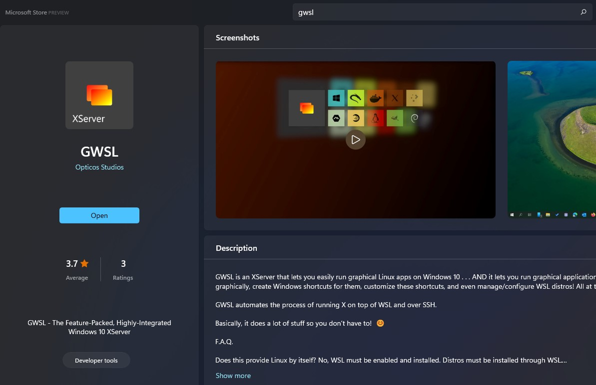
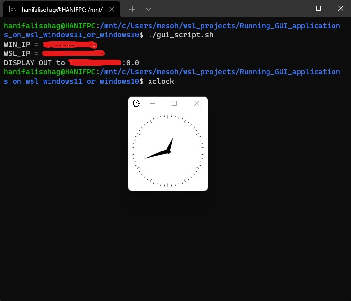
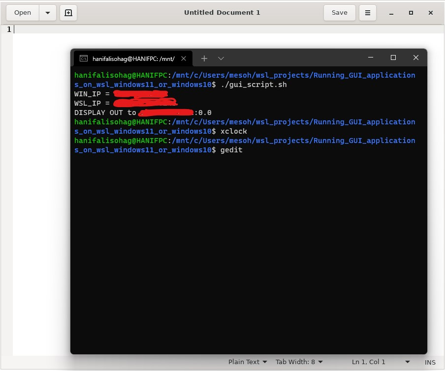

# Running_GUI_applications_on_wsl_windows11_or_windows10
Running GUI applications on windows subsystem for Linux (WSL) in windows 11 or windows 10

## *Windows Host Side*
Install the ***GWSL*** Xserver software from Microsoft Store for windows. Then open it and make sure it is running on the host windows PC.



## *WSL Side*
### Clone and provide executable permission to the script
```
git clone https://github.com/hanifalisohag/Running_GUI_applications_on_wsl_windows11_or_windows10.git
cd Running_GUI_applications_on_wsl_windows11_or_windows10 
sudo chmod +x gui_scripts.sh 
```

#### Install X11-apps 
```
apt-get update
apt-get install x11-apps
```
#### Install gedit 
``` 
apt-get install gedit
```

#### Run the script
``` 
./gui_scripts.sh 
```

### Run the applications
``` 
xclock
```

``` 
gedit 
```



# Alternately Running at Startup Automatically
1. Go to the home directory using `cd ~`
2. Then check for the `.bashrc` file
3. Edit and append the following lines at the end of the `.bashrc` file

```
WINDOWS_HOST=`cat /etc/resolv.conf | grep nameserver | cut -d ' ' -f 2`
export DISPLAY=$WINDOWS_HOST:0.0
echo DISPLAY OUT to $DISPLAY
```
4. close the terminal and reopen or source it
```
source .bashrc
```


# Alternately if you are in the WSL using SSH terminal
You can enter the following lines in the terminal while using SSH terminal

```
WINDOWS_HOST=`echo $SSH_CLIENT | awk '{ print $1}'`
export DISPLAY=$WINDOWS_HOST:0.0
echo DISPLAY OUT to $DISPLAY
```
or
```
export DISPLAY=`echo $SSH_CLIENT | awk '{ print $1}'`:0.0
```
